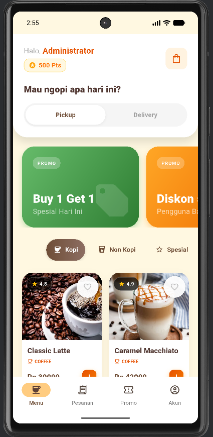
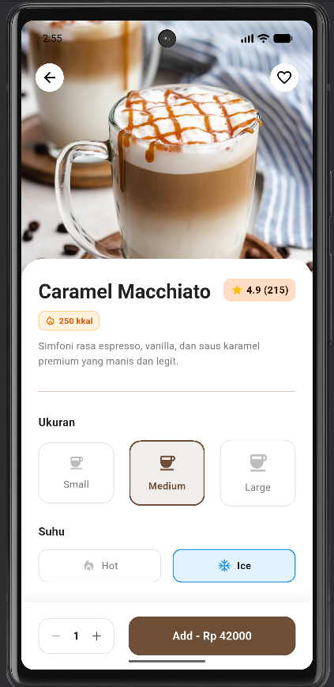
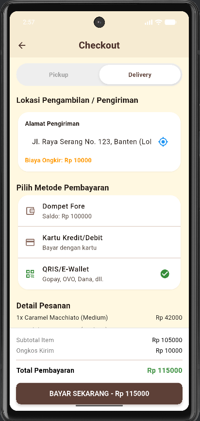
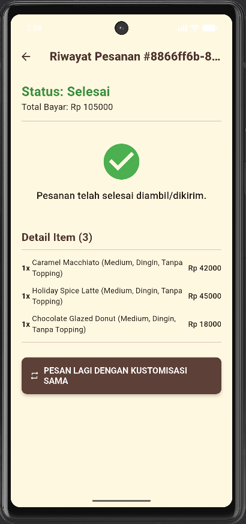

<div align="center">

  <h1>☕ Kopi Kang Dafa</h1>
  
  <p>
    <b>Aplikasi Pemesanan Kopi Premium Berbasis Flutter</b>
  </p>

  <p>
    <a href="#-fitur-unggulan">Fitur</a> •
    <a href="#-tampilan-aplikasi">Screenshots</a> •
    <a href="#-teknologi">Teknologi</a> •
    <a href="#-cara-menjalankan">Instalasi</a>
  </p>

  
  
  
  

</div>

<br />

> **Kopi Kang Dafa** adalah aplikasi *mobile coffee shop* modern yang dirancang untuk memberikan pengalaman pemesanan yang mulus dan estetis. Terinspirasi oleh *coffee chain* terkemuka, aplikasi ini menghadirkan antarmuka Material 3 yang elegan dengan fungsionalitas lengkap mulai dari pemilihan menu hingga sistem loyalitas.

---

## 👤 Identitas Pengembang

<table>
  <tr>
    <td><b>Nama</b></td>
    <td>: Dafa Naufal Yunidar</td>
  </tr>
  <tr>
    <td><b>NIM</b></td>
    <td>: 14022300026</td>
  </tr>
  <tr>
    <td><b>Universitas</b></td>
    <td>: Universitas Bina Bangsa</td>
  </tr>
</table>

> **Catatan:** Mohon maaf atas segala kekurangan yang terdapat dalam project ini. Masukan dan saran sangat diharapkan untuk pengembangan lebih lanjut.

---

## ✨ Fitur Unggulan

<table>
  <tr>
    <td>🛵 <b>Mode Fleksibel</b></td>
    <td>Pilih antara <b>Pickup</b> (Ambil Sendiri) atau <b>Delivery</b> (Pesan Antar) dengan penyesuaian lokasi otomatis.</td>
  </tr>
  <tr>
    <td>🎨 <b>Modern UI/UX</b></td>
    <td>Desain antarmuka berbasis <b>Material 3</b> dengan tema <i>Warm Cream & Vibrant Orange</i> yang estetik.</td>
  </tr>
  <tr>
    <td>📋 <b>Katalog Pintar</b></td>
    <td>Kategori lengkap (Kopi, Non-Kopi, Pastry) dengan detail nutrisi (kalori), rating, dan label <i>Best Seller</i>.</td>
  </tr>
  <tr>
    <td>🥤 <b>Kustomisasi Menu</b></td>
    <td>Atur tingkat gula, ukuran gelas, suhu (panas/dingin), hingga topping sesuai selera.</td>
  </tr>
  <tr>
    <td>🎟️ <b>Voucher & Promo</b></td>
    <td>Sistem kode voucher interaktif dan banner promo carousel yang dinamis.</td>
  </tr>
  <tr>
    <td>⭐ <b>Loyalty Rewards</b></td>
    <td>Kumpulkan poin dari setiap transaksi dan tukarkan dengan voucher diskon eksklusif langsung di aplikasi.</td>
  </tr>
  <tr>
    <td>🛒 <b>Smart Cart</b></td>
    <td>Manajemen keranjang belanja dengan kalkulasi harga, diskon, dan ongkos kirim otomatis secara <i>real-time</i>.</td>
  </tr>
</table>

## 📱 Tampilan Aplikasi

<div align="center"> 
  <table>
    <tr>
      <td align="center"><b>Home Screen</b></td>
      <td align="center"><b>Detail Menu</b></td>
      <td align="center"><b>Checkout</b></td>
      <td align="center"><b>Tracking Order</b></td>
    </tr>
    <tr>
      <!-- GANTI "screenshots/..." dengan nama folder dan file gambar lokal Anda yang sebenarnya -->
      <td></td>
      <td></td>
      <td></td>
      <td></td>
    </tr>
  </table>
</div>

## 🛠️ Teknologi

Project ini dibangun menggunakan teknologi terkini untuk memastikan performa dan skalabilitas:

- **Framework**: [Flutter](https://flutter.dev/) (SDK 3.0+)
- **Language**: [Dart](https://dart.dev/)
- **State Management**: [Provider](https://pub.dev/packages/provider)
- **Networking**: [Cached Network Image](https://pub.dev/packages/cached_network_image) (untuk manajemen gambar & cache)
- **Architecture**: MVVM (Model-View-ViewModel) pattern
- **Design System**: Material Design 3

## 📂 Struktur Project

```
lib/
├── models/         # Data models (Coffee, CartItem, Voucher, User)
├── providers/      # State management logic (ChangeNotifier)
├── screens/        # Halaman UI (Home, Detail, Cart, Profile, Checkout, Tracking)
├── widgets/        # Komponen UI yang dapat digunakan kembali
└── main.dart       # Entry point & Tema Global
```

## 🚀 Cara Menjalankan

Ikuti langkah mudah ini untuk menjalankan project di lokal Anda:

1. **Clone Repository**
   ```bash
   git clone https://github.com/username-anda/kopi-kang-dafa.git
   cd kopi-kang-dafa
   ```

2. **Install Dependencies**
   ```bash
   flutter pub get
   ```

3. **Jalankan Aplikasi**
   Pastikan emulator atau device fisik sudah terhubung.
   ```bash
   flutter run
   ```

## 🔐 Akun Demo

Gunakan akun ini untuk menguji fitur login dan simulasi profil:

| Role | Username | Password |
| :--- | :--- | :--- |
| **Admin/User** | `admin@kopi.com` | `admin123` |

> **Tips:** Anda juga bisa menggunakan tombol **"Isi Akun Demo"** di halaman login untuk pengisian otomatis.

## 📝 Lisensi

Project ini dilisensikan di bawah lisensi [MIT](LICENSE) - bebas untuk digunakan dan dimodifikasi.

---

<div align="center">
  <b>Dibuat dengan ❤️ oleh Dafa Yunidar</b><br>
  <i>Jangan lupa berikan ⭐ jika project ini bermanfaat!</i>
</div>
